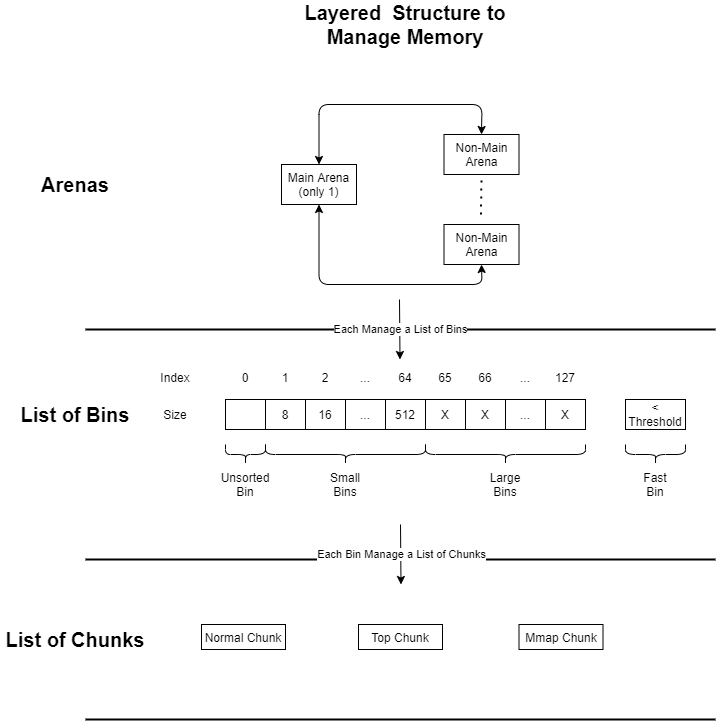
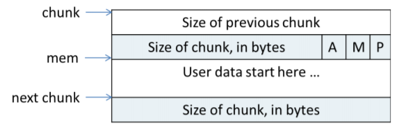
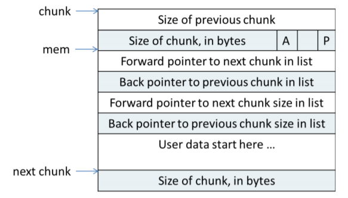

## __Analysis of result__
### __Organization of Report__ 
The report is divided into three main sections, where I discuss the design process as well as some unique implementation detials in the First Section, the result I acquired as well as my analysis towards it in the Second Section, and comparison to the glibc version of malloc & source code analysis of it. 
### __1. Implementation Overview__
#### __1.1 Locking version Implementation__
The locking version is reletively straight forward. The core datastructure in the design of this malloc library is the free list. To make it thread safe, everytime a modification is made to the free list should be protected by a lock. Since most function involes altering the list, namely insert/merge/remove list, my design is to put lock right outside the interface method `myMalloc()`.
```C
void * ts_malloc_lock(size_t size){
  assert(pthread_mutex_lock(&lock) == 0);
  void * ptr = myMalloc(size, sbrk, &head_norm, &tail_norm);//was myMalloc(size);
  assert(pthread_mutex_unlock(&lock) == 0);
  return ptr;
}
```
For `free()`, I also have a interface method `myFree()` to handle free in both versions.
```C
void ts_free_lock(void * ptr){
  assert(pthread_mutex_lock(&lock) == 0);
  myFree(ptr, &head_norm, &tail_norm);//was myFree(ptr);
  assert(pthread_mutex_unlock(&lock) == 0);
}
```
#### __1.2 No-lock version Implementation__
No lock version utilize Thread-Local Storage, which means each thread will have a seperate free list. This would eliminate most of our need to lock the body of malloc. The only portion left unprotected would be `sbrk()`system call so we simply lock it and it should be thread safe.

To make the free list thred safe, a very simple solution woule be to make free list's head and tail to a thread-local variable since they are foundation of a free list. 

After figuring this out, I realized that both version shouldn't share the same head or tail variable since they are of different type. One being `block*` and one being `__thread block*`. That said, make the version 1 free list thread-local woule make the lock superflous and possibly lead to significant performance degeneration. Consequntly, I refactored the code to make two pairs of head/tail for two version and altered the mothod to take in two input of type `block**`(if applicable) so I dont't have to duplicate code for two versions.
```C
//Normal linked list variable for lock version
block * head_norm = NULL;
block * tail_norm = NULL;
//Linked list using Thread Local Storage for no lock version
__thread block * head_tls = NULL;
__thread block * tail_tls = NULL;
```
The `malloc()` and `free()` are pretty simple since we don't have to worry about locks.
```C
void ts_free_lock(void * ptr){
  assert(pthread_mutex_lock(&lock) == 0);
  myFree(ptr, &head_norm, &tail_norm);
  assert(pthread_mutex_unlock(&lock) == 0);
}

void ts_free_nolock(void * ptr){
  myFree(ptr, &head_tls, &tail_tls);
}
```
#### __1.3 Other Non-critical Sections__
Other than the changes mentioned above, all the other portion of the code is left unchanged. Since part2 only consider best-fit, first-fit function is removed and corresponding branch in `myMalloc()` is removed.
### __2 Result and Analysis__
I runned the test 10 times for each version. The result is as follows:
|Version|Locking|No Lock|
|:-|:-|:-|
|Average Time Took|1.478|0.303|
|Maximum Time Took|1.526|0.314|
|Minimum Time Took|1.429|0.296|
|Average Segment Size(Bytes)|42470634|42515722|
|Maximum Segment Size(Bytes)|42471920|42534134|
|Minimum Segment Size(Bytes)|42468012|42496432|

#### __2.1 Result Analysis__
Based on the result, no lock version is five times faster than locking version. This significant speed up is due to the fact that we are no locking all portion of the code but rather having each thread operate on different free list so they can happen concurrently. As for locking version, all threads share one singly free list, a reletively lone free list would make it harder to find the best fit free block. 

Based on the results, there is no evident difference between two versions on the data segment size. Since the load are expected to distribute to different thread and thread count is the same for both version. We can imagine that version1's free list can be formed by connecting all free list from version2, which, should have similar data segment size performance.

### __3 Glibc version of malloc/free(used in Most Opreating System)__
#### __3.1 Basic Performance Metrics of standard library malloc/free__
To further explore this topic, I decided to look into the source code of the malloc/free library used to do memory management in real operating system. I started by running some test using this particular malloc/free. It turns out the result is much better than I expected:
|Version|Locking|No Lock|Glibc|
|:-|:-|:-|:-|
|Average Time Took|1.478|0.303|0.027|
|Average Segment Size(Bytes)|42470634|42515722|135168|

At that time my understanding of the standard malloc/free library is that it do not differ much from our implementation. That is, we all used a list sturcture to manage the memory, used some traversing algorithm to find the fitting block to assign. The only two difference that I could think of is the actual malloc uses `mmap` instead of `sbrk` when the size required exceed certain threshold and maybe some difference in how the thread-safe portion is implemented. But it turns out the difference is actually huge.

#### __3.2 Basic design Goals__
According to Doug Lea, the person who wrote this version of malloc/free. There are several goals to meet when designing a good memory management library:

_1. Maximizing Compatibility:_

An allocator should be plug-compatible with others; in particular it should obey ANSI/POSIX conventions.


_2. Maximizing Portability:_

Reliance on as few system-dependent features (such as system calls) as possible, while still providing optional support for other useful features found only on some systems; conformance to all known system constraints on alignment and addressing rules.

_3. Minimizing Space:_

The allocator should not waste space: It should obtain as little memory from the system as possible, and should maintain memory in ways that minimize fragmentation -- ``holes''in contiguous chunks of memory that are not used by the program.

_4. Minimizing Time:_

The malloc(), free() and realloc routines should be as fast as possible in the average case.

_5. Maximizing Tunability:_
Optional features and behavior should be controllable by users either statically (via #define and the like) or dynamically (via control commands such as mallopt).

_6. Maximizing Locality:_

Allocating chunks of memory that are typically used together near each other. This helps minimize page and cache misses during program execution.

_7. Maximizing Error Detection:_

It does not seem possible for a general-purpose allocator to also serve as general-purpose memory error testing tool such as Purify. However, allocators should provide some means for detecting corruption due to overwriting memory, multiple frees, and so on.

_8. Minimizing Anomalies:_

An allocator configured using default settings should perform well across a wide range of real loads that depend heavily on dynamic allocation -- windowing toolkits, GUI applications, compilers, interpretors, development tools, network (packet)-intensive programs, graphics-intensive packages, web browsers, string-processing applications, and so on.

#### __3.3 Layered Data Structure__
To achieve the above goals, a layered data sturcture is designed trying to cover all the aspect mentioned above:


#### __3.3.1 Arenas__
Arena is a structure designed to reduce the use of lock in multi-threading sccenario. Arenas are linked in a cyclic list, when requesting memory, the thread will try to acquire the lock of a certain arena. If this process fails, the thread will traverse the list trying to find a arena that is not locked. It no such arena can be found, a new arena is created and added to the list. Main Arena (the one that spawned with the process) can call both `sbrk` and `mmap`. However, Non-Main Arena can only call `mmap` to acquire memory.
#### __3.3.2 Bins__
A single Bin can be think of as the structure we used in our implementation. The difference is that each bin only hold memory block of a certain type or certain size rather than putting them all in a single list.
Bins are categorized into several types, more specifically _small bins_, _large bins_, _unsorted bins_ and _fast bins_.


_Small bins_ and _large bins_ are relatively simple. _Small bins_ only store chunks of a certain size, each bin differ in size by 8bytes. _Large bins_ stores larget chunks and chunk in a particular size range is stored in each bin. 

_Fast bins_ and _unsorted bins_ functions like a buffer to  _small bins_ and _large bins_ respectively. When trying to assign a memory, the requested size is first compared with upper size limit of fast bins. Only if the size exceed this limit or no suitable chunk is found in _fast bin_, the search go to _small bin_.

If suitable chunk is not found in _small bins_, the chunks in _fast bins_ is merged and moved to _unsorted bin_. The search now starts in _unsorted bin_. Chunks conforming to size of _small & large bins_ are moved into such bins. If still no suitable chunks found, the search starts in _large bins_. Finally, if still no match found, use top chunk or other mechanism to handle memory allocation(covered later).

#### __3.3.3 Chunks__
Chunk is analogous to the block we designed in our implementation. The difference is that chunks have more field to distinguish between different state of a chunk and to find other chunks easier:
<center>Chunk in-use</center>



<center>Free Chunk</center>



Among all the field, __A__ indicate whether chunk is in main arena; __M__ indicate whether chunk is acquired through `mmap`; __P__ indicate whether this chunk is the first in its been(no previous chunk). All the other fields are pretty self-explanatory.

#### __3.4 Summary of Data Structure__
As we can see, the glibc malloc/free utilized a much more sophisticated sturcture to do memory management and assignment. With a layered a sturcture and a cache structure, each request size range have a structure designed for it, making it less likely to generate segmented memory; at the same time, the cache (fast-bins) make sure we do not release the memory everytime a chunk is freed, making it faster for the overall memory allocation process. 

#### __3.5 Source Code__
#### __3.5.1 Boundary Alignment__
Macro definition is widely used to handle the case of running on different operating system and speed up simple calculation involved in all processes. For the basic chunk alignment:
```C
#ifndef INTERNAL_SIZE_T
// the size_t vary from platform to platform
#define INTERNAL_SIZE_T size_t
#endif
/* The corresponding word size */
#define SIZE_SZ (sizeof(INTERNAL_SIZE_T))
/*
 MALLOC_ALIGNMENT is the minimum alignment for malloc'ed chunks.
 It must be a power of two at least 2 * SIZE_SZ, even on machines
 for which smaller alignments would suffice. It may be defined as
 larger than this though. Note however that code and data structures
 are optimized for the case of 8-byte alignment.
*/
#ifndef MALLOC_ALIGNMENT
#define MALLOC_ALIGNMENT (2 * SIZE_SZ)
#endif
/* The corresponding bit mask value */
#define MALLOC_ALIGN_MASK (MALLOC_ALIGNMENT - 1)
```
Conversion from chunk pointer to pointer to usable memory and vice-versa; The minimum size of a chunk.
```C
/* conversion from malloc headers to user pointers, and back */
#define chunk2mem(p) ((Void_t*)((char*)(p) + 2*SIZE_SZ))
#define mem2chunk(mem) ((mchunkptr)((char*)(mem) - 2*SIZE_SZ))
/* The smallest possible chunk */
#define MIN_CHUNK_SIZE (offsetof(struct malloc_chunk, fd_nextsize))
/* The smallest size we can malloc is an aligned minimal chunk */
#define MINSIZE \
 (unsigned long)(((MIN_CHUNK_SIZE+MALLOC_ALIGN_MASK) & ~MALLOC_ALIGN_MASK))
/* Check if m has acceptable alignment */
#define aligned_OK(m) (((unsigned long)(m) & MALLOC_ALIGN_MASK) == 0)
#define misaligned_chunk(p) \ ((uintptr_t)(MALLOC_ALIGNMENT == 2 * SIZE_SZ ? (p) : chunk2mem (p)) \& MALLOC_ALIGN_MASK)
```
Convert the User requested size to the size of chunk to locate.
```C
/*
   Check if a request is so large that it would wrap around zero when
   padded and aligned. To simplify some other code, the bound is made
   low enough so that adding MINSIZE will also not wrap around zero.
 */
#define REQUEST_OUT_OF_RANGE(req)                                 \
  ((unsigned long) (req) >=                                                      \
   (unsigned long) (INTERNAL_SIZE_T) (-2 * MINSIZE))
/* pad request bytes into a usable size -- internal version */
#define request2size(req)                                         \
  (((req) + SIZE_SZ + MALLOC_ALIGN_MASK < MINSIZE)  ?             \
   MINSIZE :                                                      \
   ((req) + SIZE_SZ + MALLOC_ALIGN_MASK) & ~MALLOC_ALIGN_MASK)
/* Same, except also perform an argument and result check.  First, we check
   that the padding done by request2size didn't result in an integer
   overflow.  Then we check (using REQUEST_OUT_OF_RANGE) that the resulting
   size isn't so large that a later alignment would lead to another integer
   overflow.  */
#define checked_request2size(req, sz) \
({                                    \
  (sz) = request2size (req);            \
  if (((sz) < (req))                    \
      || REQUEST_OUT_OF_RANGE (sz)) \
    {                                    \
      __set_errno (ENOMEM);            \
      return 0;                            \
    }                                    \
})
```
Get the __A M P__ status bit we discussed in previous section.
```C
// P
/* size field is or'ed with PREV_INUSE when previous adjacent chunk in use */
#define PREV_INUSE 0x1
/* extract inuse bit of previous chunk */
#define prev_inuse(p)       ((p)->mchunk_size & PREV_INUSE)

// M
/* size field is or'ed with IS_MMAPPED if the chunk was obtained with mmap() */
#define IS_MMAPPED 0x2
/* check for mmap()'ed chunk */
#define chunk_is_mmapped(p) ((p)->mchunk_size & IS_MMAPPED)

// A
/* size field is or'ed with NON_MAIN_ARENA if the chunk was obtained
   from a non-main arena.  This is only set immediately before handing
   the chunk to the user, if necessary.  */
#define NON_MAIN_ARENA 0x4
/* Check for chunk from main arena.  */
#define chunk_main_arena(p) (((p)->mchunk_size & NON_MAIN_ARENA) == 0)
/* Mark a chunk as not being on the main arena.  */
#define set_non_main_arena(p) ((p)->mchunk_size |= NON_MAIN_ARENA)
```

